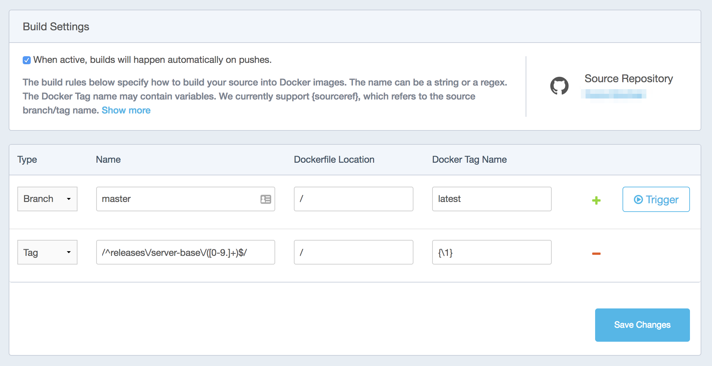

# Clora Docker Images

This repository contains the source for various Clora Docker images. These images are vanilla and have no Clora-specific contents.

## Repository structure

At the top level, there is an [`update-all.sh`](update-all.sh) script that is responsible for updating the Dockerfile for each image contained in this repository. Each image has a corresponding directory containing at least a `Dockerfile` and an executable `update.sh` script. The `update.sh` script for each image is responsible for updating its corresponding `Dockerfile`. The `update-all.sh` script calls every `update.sh` script, reports on any changes, and optionally builds each image.

### Tags

In order to tag an image, a tag in the format `releases/<image>/<version>` can be created, where `<image>` corresponds to the name of the image, and `<version>` is a string in `x.y.z` format. For example, the tag `releases/server-base/0.0.1` would result in a new image of `clora/server-base` being built and tagged as `0.0.1` in Docker Hub.

This is just a convention and is enforced on the Docker Hub side via build settings:

